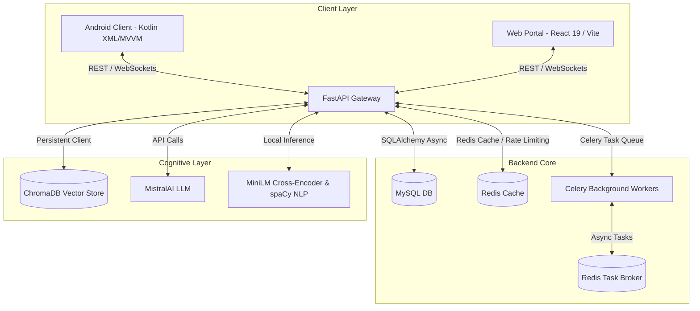

# AI Smart Career Navigator (CareerAI) 🚀

Welcome to **CareerAI**, a production-grade, highly scalable, and modern career guidance platform. CareerAI delivers personalized career recommendations, skills assessments, dynamic learning roadmaps, and an interactive RAG (Retrieval-Augmented Generation) AI assistant. 

The project is structured as a multi-tier monorepo, featuring an asynchronous Python backend, a high-fidelity React web portal, and a dark-first native Kotlin Android application.

---

## 🏛️ System Architecture

CareerAI is divided into three primary tiers:



### 📁 Repository Structure

* **[`/backend`](file:///e:/CareerAI/backend)**: Asynchronous FastAPI server executing ML algorithms, handling vector database queries, and exposing unified REST & WebSockets endpoints.
* **[`/web`](file:///e:/CareerAI/web)**: High-performance React 19 web dashboard built using Vite, Tailwind CSS v4, Framer Motion, and Recharts.
* **[`/frontend`](file:///e:/CareerAI/frontend)**: Production-grade native Kotlin Android application utilizing view binding, Jetpack Navigation, Hilt dependency injection, Room database, and Lottie animations, following a strict "Deep Space Intelligence" violet-dominant dark theme.
* **[`/database`](file:///e:/CareerAI/database)**: Houses relational schema setups and local SQLite/persistent schemas for the application core.

---

## ✨ Core Product Features

1. **AI Career Recommender**: Input skills, interests, and profile details to get personalized career recommendations computed using hybrid algorithms.
2. **Interactive RAG AI Chat**: A conversational interface powered by MistralAI and localized vector search to answer career, skill, or learning queries.
3. **Dynamic Learning Roadmaps**: Custom-generated roadmaps complete with chronological milestones, estimated hours, and resource recommendations.
4. **Skills Assessment & Quizzes**: Automated test sheets with interactive grading, detail metrics, and automated skill-gap analysis.
5. **Resume ATS Parser**: Upload layout-heavy PDFs to extract skills, project details, and calculate job-fit scores.
6. **Jobs Hub**: Personalized job matching, search filters, and profile mapping.
7. **Analytics Dashboard**: Multi-dimensional visual telemetry displaying skill progression, assessment history, and goals tracking.

---

## 🛠️ Quick Start Guide

To run the entire CareerAI suite locally, follow these steps:

### 1. Database Setup
* Ensure **MySQL 8.x** is running (e.g., via XAMPP or local service).
* Create a database named `careerai`.
* Execute the SQL schema defined in [`database/schema.sql`](file:///e:/CareerAI/database/schema.sql) to set up tables.

### 2. Launch the Backend Service
Please navigate to the `backend/` directory and configure the environment:
1. Create and activate a Python virtual environment:
   ```bash
   python -m venv .venv
   # Windows PowerShell:
   .venv\Scripts\Activate.ps1
   # Linux/macOS:
   source .venv/bin/activate
   ```
2. Install dependencies:
   ```bash
   pip install -r requirements.txt
   ```
3. Set up your `.env` file (copy parameters from `backend/README.md`).
4. Start Redis (required for Celery task queuing and caching).
5. Run the ASGI server:
   ```bash
   uvicorn main:app --reload
   ```
6. (Optional) Run the background worker in a separate terminal:
   ```bash
   celery -A app.tasks worker --loglevel=info
   ```

*For more details, see the [Backend README](file:///e:/CareerAI/backend/README.md).*

---

### 3. Run the React Web Portal
Please navigate to the `web/` directory:
1. Install node packages:
   ```bash
   npm install
   ```
2. Start the local Vite development server:
   ```bash
   npm run dev
   ```
3. Open `http://localhost:5173` in your browser.

*For more details, see the [Web Client README](file:///e:/CareerAI/web/README.md).*

---

### 4. Build the Android Client
Open the `frontend/` directory in **Android Studio**:
1. Sync Gradle dependencies.
2. Update the API base URL in `data/remote/` configuration files to point to your backend local IP or `http://10.0.2.2:8000` (Android Emulator loopback).
3. Run the application on an emulator or physical device running API 24+.

*For more details, see the [Android Client README](file:///e:/CareerAI/frontend/README.md).*

---

## 📄 License & Verification
For diagnostic checks, compiler verification, or to test endpoints programmatically, run:
```bash
cd backend
python scripts/verify_system.py
```
Check [`backend/checks.md`](file:///e:/CareerAI/backend/checks.md) for generated logs and architecture specs.
