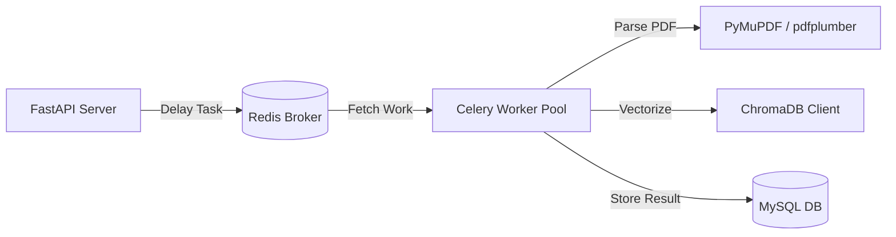

# CareerAI — Asynchronous Backend Service ⚙️

Welcome to the backend core of **CareerAI**, a production-grade, highly scalable asynchronous FastAPI microservice. The service implements sophisticated career-path finding algorithms, hybrid search semantic-matchers, RAG chatbot layers, layout-aware PDF extraction engines, and Celery tasks queues.

---

## ⚡ Key Architectural Features

1. **FastAPI ASGI Gateway**: High-concurrency async REST API & WebSockets.
2. **Hybrid Search RAG**: Combines local Okapi BM25 sparse search and ChromaDB dense vector indexing, filtered using an `ms-marco-MiniLM-L-6-v2` Cross-Encoder reranker.
3. **Advanced DSA Algorithms**: Includes custom Graph-theory algorithms (e.g., career-graph path calculation in `career_graph.py` and recommendations in `recommendation.py`).
4. **Celery Worker Pipelines**: Offloads heavy tasks (e.g., layout-aware PDF parsing and resume vectorization) to parallel background queues managed by Redis.
5. **Robust Database Layer**: Dual persistence strategy using SQLAlchemy 2.0 (Async) + MySQL for user data and ChromaDB for vector base.

---

## 📡 API Service Routers

The API gateway mounts the following routers at `/api/v1`:

| Router Prefix | Tag | Description | Core Endpoints |
| --- | --- | --- | --- |
| `/auth` | `Authentication` | User lifecycle, OTP verification, JWT session tokens. | `/register`, `/login`, `/verify-otp`, `/refresh` |
| `/users` | `User Profiles` | Manages user metadata, skills matrix, onboarding flags. | `/me`, `/skills`, `/onboard` |
| `/careers` | `Careers` | Career exploration, Graph algorithms, Skill dependencies. | `/search`, `/{slug}`, `/{slug}/graph` |
| `/assessments` | `Assessments` | Dynamic quiz creation, live grading, assessment results. | `/list`, `/quiz`, `/grade`, `/results` |
| `/roadmaps` | `Learning Roadmaps` | Dynamic milestone planning, study time recommendations. | `/create`, `/{id}`, `/milestones` |
| `/jobs` | `Jobs Matching` | Core jobs search, recommendation algorithms, profiles fit. | `/match`, `/search`, `/{id}` |
| `/rag` | `Knowledge RAG` | Vector database search, semantic context answers. | `/query`, `/kb/status` |
| `/resumes` | `Resumes ATS` | Multi-engine PDF layout parser (PyMuPDF, pdfplumber). | `/upload`, `/{id}/parse` |
| `/analytics` | `Dashboard Analytics` | Progress diagnostics, skill gap tracking, history. | `/overview`, `/skill-gap` |
| `/notifications` | `Notifications` | Dynamic user alerting system, transactional emails. | `/list`, `/read` |
| `/ws` | `WebSockets` | Real-time full-duplex channels (e.g., chat stream). | `/ws/chat`, `/ws/notifications` |

---

## 🧠 AI Cognitive & Machine Learning Stack

CareerAI features a hybrid cognitive stack:

* **Reasoning Agent**: **MistralAI** (via SDK `mistralai>=1.0.0`) provides roadmap generation and RAG reasoning synthesis.
* **Dense Vectors**: Custom sentence-transformer client parsing documents into 384-dimensional dense vectors using **`all-MiniLM-L6-v2`**.
* **Semantic Reranking**: Locally loaded **`ms-marco-MiniLM-L-6-v2`** Cross-Encoder model. Reranks vector retrieval results for maximum precision.
* **Natural Language Parsing**: **spaCy NLP** (`en_core_web_sm`) is utilized for Named Entity Recognition (NER), extracting skills, projects, and educational details from uploaded resumes.
* **Sparse Indexing**: Local **Okapi BM25** implementation coordinates fast matching on exact keyword syntax.
* **Vector Base**: Persistent **ChromaDB** client storing chunked knowledge base documents.

---

## ⚙️ Celery Async Tasks System

Heavy document parsing, vector database indexing, and external notification dispatches are run asynchronously in Celery background workers.



* **Redis Broker**: Operates at `redis://localhost:6379/0`.
* **Celery Engine**: Defined in `app/tasks/celery_app.py`.
* **Flower Monitor**: Visual metrics board tracking workers, task failures, execution latencies, and worker health.

---

## 🛠️ Telemetry & System Diagnostics

CareerAI includes scripts to verify that your configurations and service connections are correctly integrated:

```bash
# Run system diagnostics
python scripts/verify_system.py

# Verify router endpoints and connections
$env:PYTHONPATH="."; python scripts/test_endpoints.py
```

These validation scripts write detailed report logs to the `checks.md` file in this directory.

---

## 🚀 Quick Setup Guide

### 1. Prerequisites
Verify you have the following running locally:
* **Python 3.12+**
* **MySQL 8.x** (e.g., through XAMPP or local server)
* **Redis 7.x**

### 2. Environment Configurations (`.env`)
Create a `.env` file in the `backend/` directory:
```ini
APP_NAME="AI Smart Career Navigator"
APP_ENV="development"
DEBUG=true

# JWT Encryption
SECRET_KEY="your-jwt-signing-secret-key-goes-here"
ACCESS_TOKEN_EXPIRE_MINUTES=60

# Relational Database (MySQL)
DATABASE_URL="mysql+aiomysql://root:@localhost:3306/careerai"

# Redis Cache / Broker
REDIS_URL="redis://localhost:6379/0"

# MistralAI Key
MISTRAL_API_KEY="your-mistral-api-key"

# Vectors Directory
CHROMA_PERSIST_DIR="../database/vector_data"
```

### 3. Setup Virtual Environment & Run
1. Create and activate environment:
   ```bash
   python -m venv .venv
   .venv\Scripts\Activate.ps1   # Windows PowerShell
   source .venv/bin/activate    # Linux/macOS
   ```
2. Install dependencies:
   ```bash
   pip install --upgrade pip
   pip install -r requirements.txt
   ```
3. Initialize the MySQL tables using schema script in `../database/schema.sql`.
4. Run the API ASGI server:
   ```bash
   uvicorn main:app --reload
   ```
5. In a new terminal (with active virtual env), start Celery workers:
   ```bash
   celery -A app.tasks worker --loglevel=info
   ```