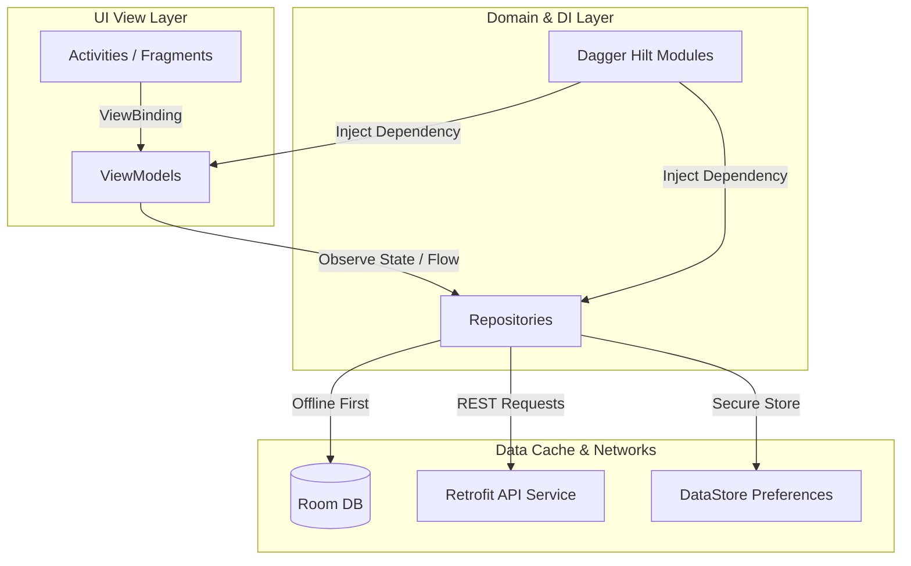

# CareerAI — Native Kotlin Android Client 📱

Welcome to the mobile client codebase of **CareerAI**, a premium, production-grade Android application built with native **Kotlin** and XML ViewBinding. The application follows strict clean-code architecture patterns (MVVM + Repository) and implements a gorgeous, dark-first violet-dominant interface.

---

## 🏛️ Project Architecture & Design Patterns

The client is modularly structured, incorporating Clean Architecture practices to isolate business logic, UI frameworks, and data retrieval structures.



### Key Libraries & Tech Stack

* **Dependency Injection**: **Dagger Hilt** (`hilt-android`) for modular DI container setup.
* **Networking**: **Retrofit 2** + **OkHttp 3** featuring authorization token interceptors and HTTP logging.
* **Persistence & Cache**:
  * **Room Database**: Offline-first data model caching (e.g., job history, profiles, roadmaps).
  * **DataStore Preferences**: SessionManager storage mapping authentication tokens and user onboarding states.
* **Navigation**: Jetpack **Navigation Component** coordinating safe-args fragment transitions.
* **Aesthetics & UI**:
  * **Lottie Animations**: Streamlines high-fidelity visual assets, loading shimmers, and empty states.
  * **Markwon Markdown**: Formats RAG chatbot responses, including bullet lists and code styling blocks.
  * **MPAndroidChart**: Powers interactive analytics diagrams, skill-gap radars, and progression line charts.

---

## 🎨 Visual Identity Spec ("Deep Space Intelligence")

In compliance with the system design document [`design.md`](file:///e:/CareerAI/design.md), the client applies strict visual principles:

1. **Dark-First Surface Depth**: Uses layered black tokens (`color_background` at `#060608`, ink `color_surface_1` at `#0F0F1C`, and elevated slate variants) rather than standard flat grays.
2. **Violet Core Brand**: `#6D28D9` to `#A78BFA` gradients represent AI components and CTAs. Cyan (`#22D3EE`) is reserved exclusively for streaming states. No amber, gold, or warm colors are used.
3. **AVD & Micro-Interactions**:
   * Bottom Navigation tabs trigger Animated Vector Drawable (AVD) path-drawing animations and smooth, spring-interpolated vertical view-lifts when clicked.
   * Buttons scale down on touch for immediate feedback (`applyPressAnimation`).
4. **Layout-Aware Input**: Automatically hides the bottom navigation bar when soft keyboards (IME) are displayed.

---

## 📂 Core Packages & Module Breakdown

* **`com.aicareer.navigator`**:
  * **`SplashActivity`**: Session gatekeeper. Validates user onboarding and token states to redirect to Auth or Main dashboards.
  * **`AuthActivity`**: Host for login, register, and custom OTP screen fragments.
  * **`MainActivity`**: Main dashboard controller. Integrates bottom nav layout and deep-link routing.
  * **`data/`**:
    * `datastore/`: Houses `SessionManager` preferences storage.
    * `local/`: Local database entities, converters, and Room DAO interfaces.
    * `remote/`: Retrofit networking clients and DTO models.
    * `repository/`: Single-source-of-truth Repository managers.
  * **`di/`**: Dagger Hilt module bindings.
  * **`ui/`**: Feature fragments grouped by feature module (e.g., `analytics`, `assessment`, `auth`, `career`, `home`, `jobs`, `rag` Chat, `resume`, `roadmap`).

---

## 🚀 Building & Running Locally

### 1. Prerequisites
* **Android Studio Koala / Ladybug** or newer.
* **Android SDK 34** installed.
* **Java SDK (JDK) 17** (or toolchain configured in Android Studio).

### 2. Configure API Endpoint
Retrofit parameters are configured under `com.aicareer.navigator.data.remote`.
Ensure you update the target IP domain address to match your local network address or point to the standard emulator loopback address:
```
http://10.0.2.2:8000/api/v1/
```

### 3. Compile & Install
1. Open the project in Android Studio (pointing to the `/frontend` subfolder).
2. Sync Gradle dependencies: `File -> Sync Project with Gradle Files`.
3. Select your target device (Emulator or USB Debugging physical device running min API 24).
4. Click **Run** (`Shift + F10`) or use the gradle wrapper:
   ```bash
   ./gradlew assembleDebug
   ```
