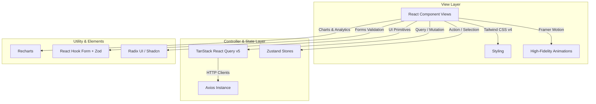

# CareerAI — React Web Portal 🌐

Welcome to the web client of **CareerAI**, a modern, high-performance career guidance dashboard. The application is built using **React 19**, **Vite**, and **Tailwind CSS v4**, delivering responsive user interfaces, fluid animations, and premium glassmorphic visual designs.

---

## 🛠️ Tech Stack & Engineering Architecture

The web client is engineered using a robust set of modern React ecosystem packages:



### Key Libraries

* **Framework & Build Tool**: **React 19** + **Vite** for fast HMR (Hot Module Replacement) and optimized bundling.
* **Styling**: **Tailwind CSS v4** + `@tailwindcss/vite` plugin.
* **Routing**: **React Router DOM v7** coordinating public authorization routes and protected client panels.
* **State Management**: **Zustand** for lightweight store systems (e.g., user profiles, theme toggles, auth session states).
* **Data Fetching & Cache**: **TanStack React Query v5** managing cache syncing, data prefetching, and loading states.
* **Visuals & Charts**:
  * **Framer Motion**: Smooth page transitions, slider milestones, hover expansions.
  * **Recharts**: Responsive data visualization graphs (e.g., career analytics, quiz scores, skill gap radars).
  * **Hugeicons React**: Modern outline icon library.
  * **Canvas Confetti**: Celebration effects upon successful quiz completions.
  * **Sonner**: Premium, customizable toast alerts.

---

## 🚦 Application Features & Route Mapping

The web portal implements a feature-based folder structure under `src/features`:

| Path | Feature Section | Description |
| --- | --- | --- |
| `/` | `home` / Landing | Product showcase page detailing features and benefits. |
| `/login`, `/register` | `auth` | User entry points featuring OTP validation. |
| `/onboarding` | `onboarding` | Skill profiles and interests setup wizard. |
| `/dashboard` | `home` / Dashboard | Career telemetry feed, quick metrics, matching jobs. |
| `/careers` | `career` | Career directory search, skills hierarchy, recommendation engine. |
| `/chat` | `chat` (RAG) | MistralAI chatbot UI with markdown renderers. |
| `/assessments` | `assessment` | Multi-category quizzes, timer tests, skill gap scoring. |
| `/roadmap` | `roadmap` | Interactive milestones timeline showing estimated course hours. |
| `/jobs` | `jobs` | Curated career matchings, query filtering, detail view pages. |
| `/resume/upload` | `resume` | PDF upload panel running layouts-aware parsing. |
| `/profile` | `profile` | Detailed resume statistics, personal skill matrices. |
| `/analytics` | `analytics` | Telemetry summaries, skill progress line charts. |
| `/settings` | `profile` / Settings | Password updates and system preferences. |

---

## 🎨 Design Philosophy & UX Patterns

The interface mirrors the **"Deep Space Intelligence"** dark-first layout established in the Android client:

* **Glassmorphism Base**: Component card surfaces use semi-transparent white-glass tokens (`rgba(255, 255, 255, 0.03)`) paired with backdrop filters to create depth layers on the dark base backdrop.
* **Brand Violet Accent**: Employs deep purple tones for default components and bright violet gradients for AI integrations. Live/active states use cyan highlights.
* **Interactive Responsive Feed**: The grid system is mobile-friendly, adjusting columns dynamically. Hover overlays and active click animations are implemented across all cards, chips, and buttons.

---

## 🚀 Setup & Local Execution

Ensure you have **Node.js (v18+)** installed.

### 1. Installation
Navigate to the `web/` directory and install the required dependencies:
```bash
npm install
```

### 2. Environment Variables
Verify your environment variables are configured correctly. The web client communicates with the API service by default at:
```
http://localhost:8000/api/v1
```

### 3. Run Development Server
Start the local server with hot reloading:
```bash
npm run dev
```
Open `http://localhost:5173` in your browser.

### 4. Build for Production
To bundle and compile optimized static assets:
```bash
npm run build
```
Verify the production build folder locally:
```bash
npm run preview
```
